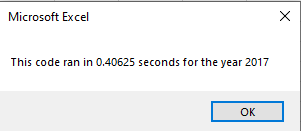
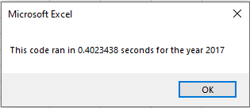
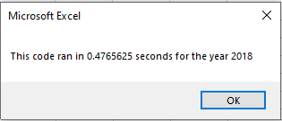

# Green Stocks

## Overview of Project
The purpose of this analysis is to help Steve and his parents make decisions on which green-energy stocks look like the best investments. 

## Results
The results indicated two distinct findings
- The first finding is that in [2017](resources/2017_table.png), with one exception (TERP), were all (ironically) in the green. The market value went up significantly during this time period. 
- The second finding is that in [2018](resources/2018_table.png), with two exceptions (ENPH and RUN), stocks were down significantly but not down as much as they were to start the 2017 session. The runtime for 2018 can be seen [here](resources/VBA_Challenge_2018.png)

### Runtime differences between original and refactored code
The difference in runtime from the original green_stocks code and the refactored code can be illustrated here.

Original is on the left, refactored on the right

 

  = 0.4765625

Against my expectations, the code took longer to run once refactored. 

## Summary
The advantages of refactoring code include more versatility, reducing complexity, 

