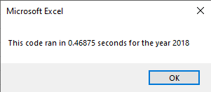
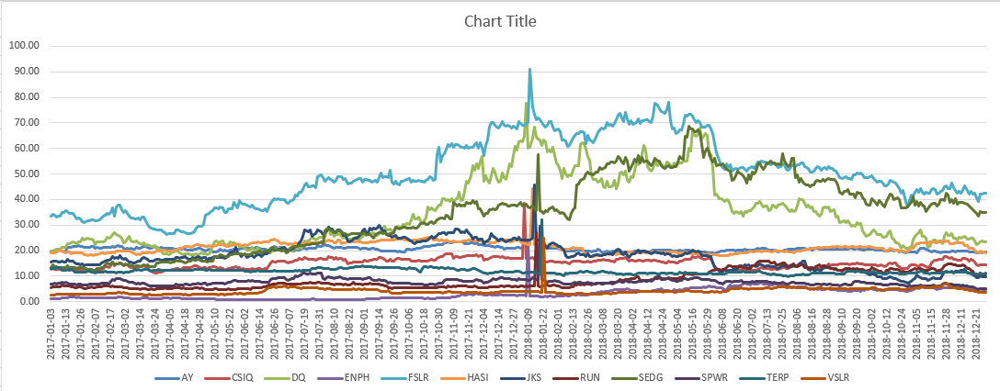
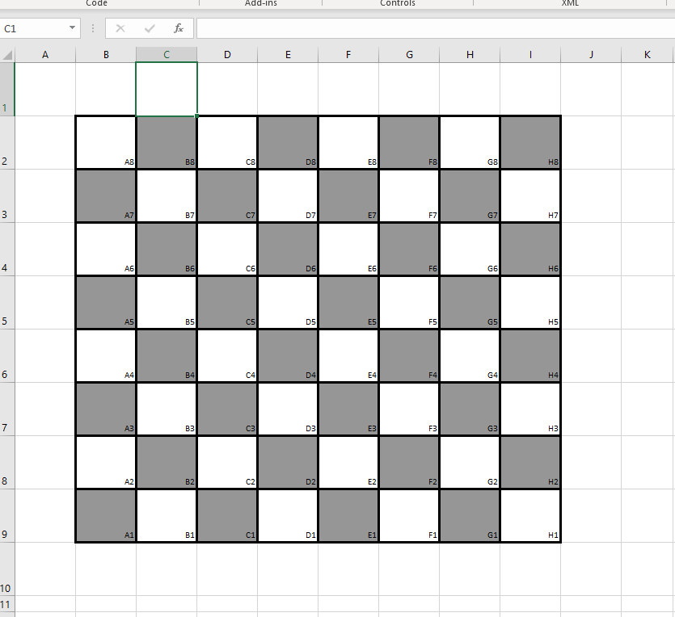

# Green Stocks

## Overview of Project
The purpose of this analysis is to help Steve and his parents make decisions on which green-energy stocks to invest in using 2017 and 2018 calendar year market data and analysis. 

This project in particular, compared to the previous modules, is to refactor the code that we've built so we can make it easier to understand, and improve adaptability of the code to other datasets in case we are provided an opportunity to reuse this code. 

## Results

The results indicated two distinct findings

- The first finding is that in [2017](resources/2017_table.png), with one exception (TERP), were all (ironically) in the green. The market value went up significantly during this time period. 

- The second finding is that in [2018](resources/2018_table.png), with two exceptions (ENPH and RUN), stocks were down significantly but not down as much as they were to start the 2017 session.

I went a step further and created an additional tab in the worksheet that combines the data found in both 2017 and 2018 so we can look at total value change for each ticker. Overall, the stock that increased the most was ENPH, and the stock that went down the most was JKS. Overall, the increase in value in 2017 overshadowed the market dip in 2019, making most of these stocks a good option for purchase based on low price point and proven market performance. Table can be viewed [here](resources/2017_vs_2018_table.png).

### Runtime differences between original and refactored code
The difference in runtime from the original green_stocks code and the refactored code can be illustrated here.

Original is on the left, refactored on the right

 

 

Against my expectations, the code took longer to run once refactored. 

## Summary

### Advantages and disadvantages of refactoring code

The advantages of refactoring code include more versatility, reducing complexity, and improving the understandability of the code. Using refactored code can help other developers to adapt your code for their needs. Another advantage, although apparently not in my example, is improved run speed of the code and performance.

The disadvantages of refactoring code depend greatly on who is doing the refactoring and why they're doing it. A great example of a disadvantage would be new bugs that appear in the code that weren't there before, taking up time to debug. Other issues are changed code behavior and outcomes that aren't immediately noticed once refactored. 

### Advantages and disadvantages of refactoring this VBA script

Advantages of refactoring this VBA script include the ease of adding different ticker information to the 2017 and 2018 tabs, such as PE ratio or other stock market metrics. Using variables for the ticker index makes it easier to add different tickers, or even to remove them from the code. 

Disadvantages include difficulty in locating different bugs in the code should they arise. Also, in this particular example, the run time was increased after refactoring. The specific refactoring guidelines also don't account for the possibility of this code running for an entire stock index such as the NASDAQ or S&P500 which have hundreds if not thousands of different stock tickers as opposed to just the 12 outlined here. 

## Issues with the data

Out of curiosity, I decided to run a pivot table on the data to make a line chart for the different tickers. I have found that some of the data is incomplete or inconsistent. It appears that at the start of 2018, some of the ticker information is drastically inflated or distorted in some way. I even went into the data itself to find that these are infact issues with the data set and not my pivot table or line chart. This can be seen here:



## Extras
Also in the challenge file is a fun self-invented project that I did inspired by one of the "skill drill" exercises in the modules. I created a vbs script that creates an accurate chess board with proper square names using all of the formatting and loops that were taught in the course. I'm quite proud of it.




Code can be read here:

```
Sub createChessBoard()
    
    Worksheets("Chess").Activate

    'create squares
    For x = 1 To 8
        For y = 1 To 8
            Cells(x + 1, y + 1).Value = x + y
            If Cells(x + 1, y + 1).Value Mod 2 = 1 Then
                Cells(x + 1, y + 1).Interior.ColorIndex = 48
            Else
                Cells(x + 1, y + 1).Interior.ColorIndex = 2
            End If
        Next y
    Next x
    
    'make rectangles into squares
    Columns("A:J").ColumnWidth = 10
    Rows("1:10").RowHeight = 50
    'make square borders
    Range("B2:I9").Borders().LineStyle = xlContinuous
    Range("B2:I9").Borders().Weight = xlThick
    
    Cells.ClearContents
    Call createSquareNames
    
End Sub

Sub createSquareNames()
    'make sure we're on the right sheet
    Worksheets("Chess").Activate
    
    'create variable so we can reverse the order of ranks
    Dim reverse As Integer
    reverse = 8
    
    'create the names
    For Rank = 1 To 8
        For File = 1 To 8
            If File = 1 Then
                Cells(Rank + 1, File + 1).Value = "A" & reverse
            End If
            If File = 2 Then
                Cells(Rank + 1, File + 1).Value = "B" & reverse
            End If
            If File = 3 Then
                Cells(Rank + 1, File + 1).Value = "C" & reverse
            End If
            If File = 4 Then
                Cells(Rank + 1, File + 1).Value = "D" & reverse
            End If
            If File = 5 Then
                Cells(Rank + 1, File + 1).Value = "E" & reverse
            End If
            If File = 6 Then
                Cells(Rank + 1, File + 1).Value = "F" & reverse
            End If
            If File = 7 Then
                Cells(Rank + 1, File + 1).Value = "G" & reverse
            End If
            If File = 8 Then
                Cells(Rank + 1, File + 1).Value = "H" & reverse
            End If
        Next File
        'this changes the file number
        reverse = reverse - 1
    Next Rank
    'align cells to bottom right and make small
    Range("B2:I9").HorizontalAlignment = -4152
    Range("B2:I9").Font.Size = 8
    
End Sub
```

